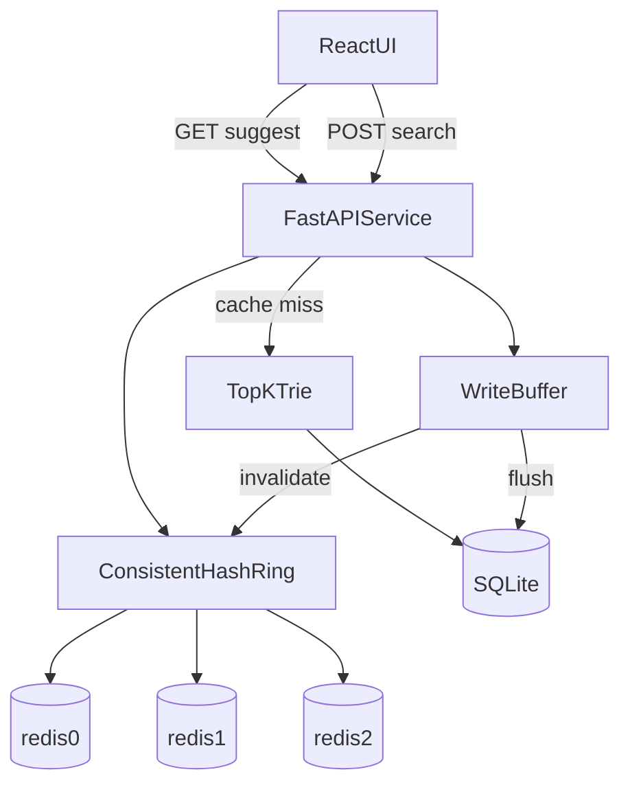

# Architecture

## Overview

The typeahead system follows a read-optimized, write-buffered architecture:

1. **SQLite** stores durable query counts.
2. **In-memory trie** serves prefix suggestions in O(prefix length) with precomputed top-10 at each node.
3. **Three Redis nodes** cache prefix results, sharded by application-level consistent hashing (requires Docker).
4. **Batch writer** aggregates `POST /search` events and flushes to SQLite periodically.

The trie loads high-frequency queries (`global_count >= 10`) for fast startup; long-tail prefixes fall back to SQLite prefix search.

## Read path

1. Normalize prefix (trim, lowercase, collapse whitespace).
2. Hash cache key `suggest:{mode}:{prefix}` to a Redis node via consistent hashing.
3. On cache hit, return cached JSON suggestions.
4. On miss, walk trie, fetch top-K, populate cache with TTL, return response.

## Write path

1. `POST /search` enqueues `{query, timestamp}` and returns immediately.
2. Background flusher aggregates duplicate queries.
3. One SQLite transaction updates counts and `last_seen`.
4. Trie counts are updated incrementally.
5. All prefixes of changed queries are invalidated in Redis.

## Why these components

| Component | Role |
|-----------|------|
| SQLite | Zero-setup durable store for 1.24M seeded queries |
| Trie + top-K | Avoid query-time sorting; meet low-latency requirement |
| Redis x3 + consistent hashing | Distributed cache with explicit ownership for debug/demo |
| Batch buffer | Reduce DB writes; demonstrate aggregation benefit |

## Consistent hashing

Each physical Redis node is mapped to 150 virtual nodes on an MD5 hash ring. A prefix cache key is assigned to the first vnode clockwise from its hash. Adding/removing a node remaps only ~1/N keys.

Use `GET /cache/debug` and `POST /cache/demo/rebalance` to inspect routing behavior.
